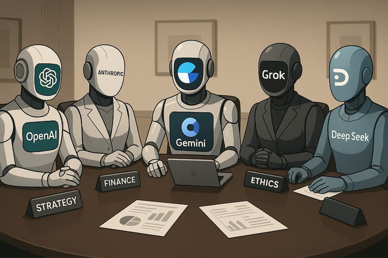

# LLM Council → Personal Board of Directors



## About This Project

This project began as **[LLM Council](https://github.com/karpathy/llm-council)** by **[Andrej Karpathy](https://github.com/karpathy)** - a nifty "vibe code" Saturday hack exploring how multiple LLMs can deliberate together through a 3-stage process of individual responses, peer review, and synthesis.

**This fork extends that concept** into a **Personal Board of Directors** - where instead of generic LLMs, you configure specialized AI agents (Ethics Advisor, Technology Expert, Leadership Coach, Financial Advisor, etc.) that provide perspective-aware guidance on your questions and decisions.

## Original Concept (Credit: Andrej Karpathy)

Instead of asking a single LLM, you query multiple LLMs working as a council:

1. **Stage 1: Individual Opinions** - Each LLM responds to your question independently
2. **Stage 2: Anonymized Peer Review** - LLMs rank each other's responses (identities hidden to prevent bias)
3. **Stage 3: Chairman Synthesis** - A designated chairman synthesizes the collective wisdom into a final answer

This elegantly surfaces multiple perspectives and cross-evaluations, which Andrej created for [reading books together with LLMs](https://x.com/karpathy/status/1990577951671509438).

## What's New: Board of Directors Evolution

We're transforming the anonymous council into a **personal board of directors** with:

✨ **Agent System** - Define specialized advisors with titles, roles, and custom prompts
✨ **Prompt Management** - Fully customizable prompts for each stage, per-agent or globally
✨ **Role-Aware Responses** - Agents respond from their expertise perspective (Ethics Advisor evaluates morally, Tech Expert evaluates technically, etc.)
✨ **Persistent Configuration** - Your board composition and prompts are saved
✨ **Default Templates** - Pre-configured advisors ready to use out of the box

See [TODO.md](TODO.md) for the full roadmap including conversation memory, analytics, and advanced features.

## How It Works

When you submit a query to your board:

1. **Stage 1: Expert Perspectives** - Each board member (agent) responds from their specialized viewpoint
2. **Stage 2: Peer Evaluation** - Board members rank each other's responses anonymously
3. **Stage 3: Synthesis** - Your designated chairman synthesizes all perspectives into actionable guidance

All responses, rankings, and the final synthesis are visible for full transparency.

## Setup

### 1. Install Dependencies

The project uses [uv](https://docs.astral.sh/uv/) for project management.

**Backend:**
```bash
uv sync
```

**Frontend:**
```bash
cd frontend
npm install
cd ..
```

### 2. Configure API Key

Create a `.env` file in the project root:

```bash
OPENROUTER_API_KEY=sk-or-v1-...
```

Get your API key at [openrouter.ai](https://openrouter.ai/). Make sure to purchase the credits you need, or sign up for automatic top up.

### 3. Initialize Your Board (Optional)

**Option 1: Use Default Board**

After starting the app, navigate to the Prompt Manager and click "Initialize Default Agents" to create 4 pre-configured board members:
- Ethics & Values Advisor (Claude Sonnet 4.5)
- Technology & Innovation Expert (GPT-5.1)
- Leadership & Strategy Coach (Gemini 3 Pro)
- Financial & Business Advisor (Grok 4)

**Option 2: Keep Legacy Mode**

Edit `backend/config.py` to use models directly without agents:

```python
COUNCIL_MODELS = [
    "openai/gpt-5.1",
    "google/gemini-3-pro-preview",
    "anthropic/claude-sonnet-4.5",
    "x-ai/grok-4",
]

CHAIRMAN_MODEL = "google/gemini-3-pro-preview"
```

The system falls back to these models if no agents are configured.

## Running the Application

**Option 1: Use the start script**
```bash
./start.sh
```

**Option 2: Run manually**

Terminal 1 (Backend):
```bash
uv run python -m backend.main
```

Terminal 2 (Frontend):
```bash
cd frontend
npm run dev
```

Then open http://localhost:5173 in your browser.

## Tech Stack

- **Backend:** FastAPI (Python 3.10+), async httpx, OpenRouter API
- **Frontend:** React + Vite, react-markdown for rendering
- **Storage:** JSON files in `data/` (conversations, agents, prompts)
- **Package Management:** uv for Python, npm for JavaScript

## Key Features (v1.0.0 MVP)

🔐 **Multi-User Authentication**
- Clerk authentication with passkeys and SSO (Google/Microsoft)
- Per-user data isolation - each user has their own board
- JWT-based API security

📋 **Agent Configuration System**
- Define custom board members with titles, roles, and expertise areas
- Per-agent custom prompts for each deliberation stage
- Active/inactive agent management
- Designate any agent as chairman

🎨 **Prompt Management UI**
- Edit prompts for all three deliberation stages
- Default prompts with per-model overrides
- Real-time preview and validation
- Reset to defaults anytime

💾 **Persistent Storage**
- User-scoped JSON storage (`data/users/{user_id}/`)
- Conversation history with full metadata
- Import/export ready for future features

🚀 **Production Deployment**
- Dockerized for easy deployment
- Railway-ready with persistent volume support
- Environment-based configuration

## Project Structure

```
llm-council/
├── backend/
│   ├── agent_storage.py      # Agent CRUD operations
│   ├── prompt_storage.py     # Prompt management
│   ├── council.py            # 3-stage deliberation logic
│   ├── openrouter.py         # OpenRouter API client
│   └── main.py               # FastAPI server
├── frontend/
│   └── src/
│       ├── components/
│       │   ├── PromptManager.jsx  # Prompt editing UI
│       │   └── ChatInterface.jsx  # Main chat interface
│       └── api.js            # API client
└── data/
    ├── agents.json           # Agent configurations
    ├── prompts.json          # Custom prompts
    └── conversations/        # Chat history
```

## Production Deployment (Railway)

The app is configured for one-click deployment to Railway:

1. **Prerequisites:**
   - Railway account
   - Clerk account (for authentication)
   - OpenRouter API key

2. **Deploy:**
   - Connect your GitHub repo to Railway
   - Add environment variables:
     - `OPENROUTER_API_KEY` - Your OpenRouter key
     - `CLERK_ISSUER` - Your Clerk instance URL (e.g., `https://your-app.clerk.accounts.dev`)
     - `VITE_CLERK_PUBLISHABLE_KEY` - Hardcoded in Dockerfile (public key)
   - Add persistent volume: mount `data` to `/app/data`

3. **Configure Clerk:**
   - Enable Passkeys, Google OAuth, and/or Microsoft OAuth
   - Add your Railway domain to allowed origins

See `Dockerfile` and `railway.toml` for configuration details.

## Security & Privacy

### User Data Isolation

The application enforces strict user data isolation:

1. **Authentication**: Users authenticate via Clerk JWT tokens. The `user_id` is extracted from the verified token and cannot be spoofed by users.

2. **Path-based Isolation**: All user data is stored in separate directories:
   ```
   data/users/{user_id}/conversations/{conversation_id}.json
   data/users/{user_id}/agents.json
   data/users/{user_id}/prompts.json
   ```

3. **UUID Validation**: All conversation and agent IDs are validated as proper UUIDs before any file operations, preventing path traversal attacks.

4. **Defense in Depth**:
   - User IDs always come from verified JWTs, never from user input
   - All API endpoints require authentication via `Depends(get_current_user_id)`
   - Storage functions validate ID formats to reject malicious inputs

### Privacy Considerations

- **Data sent to LLM providers**: Your queries are sent to multiple third-party LLM providers via OpenRouter. Be mindful of what information you share.
- **Local storage**: Conversation history is stored in JSON files on the server.
- **No encryption at rest**: Data files are stored in plain JSON. For sensitive deployments, consider encrypting the data volume.

## Contributing

This is an active fork evolving the original concept. See [TODO.md](TODO.md) for the roadmap. Contributions welcome!

## Credits

- **Original Concept:** [Andrej Karpathy](https://github.com/karpathy) - [llm-council](https://github.com/karpathy/llm-council)
- **Board of Directors Evolution:** This fork by [adam-wood](https://github.com/adam-wood)
